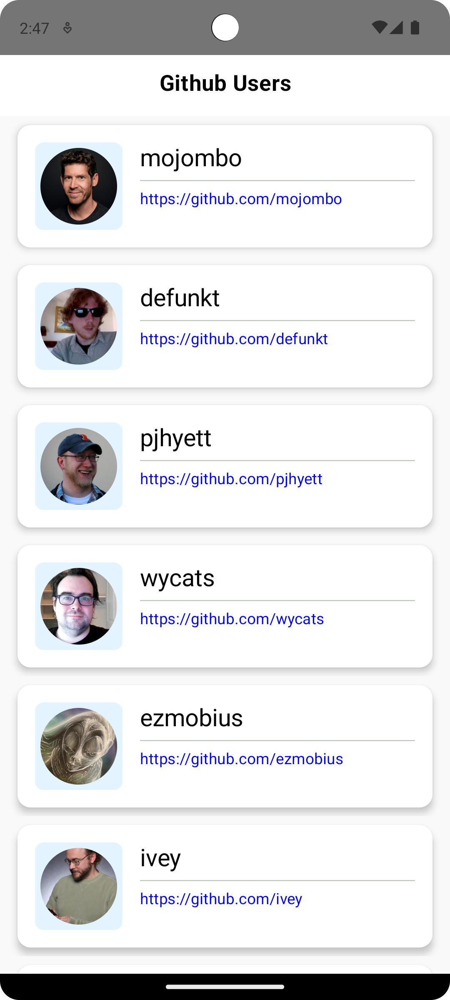
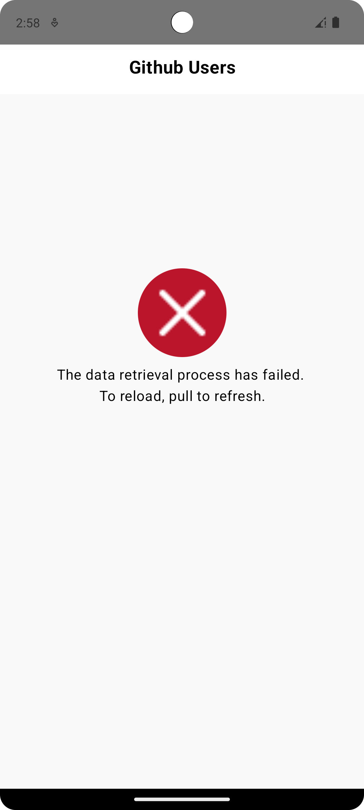
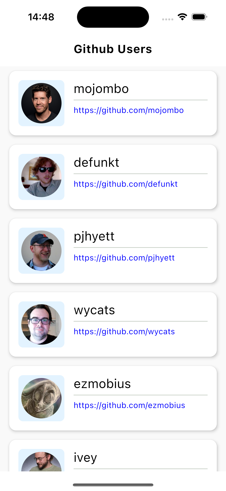
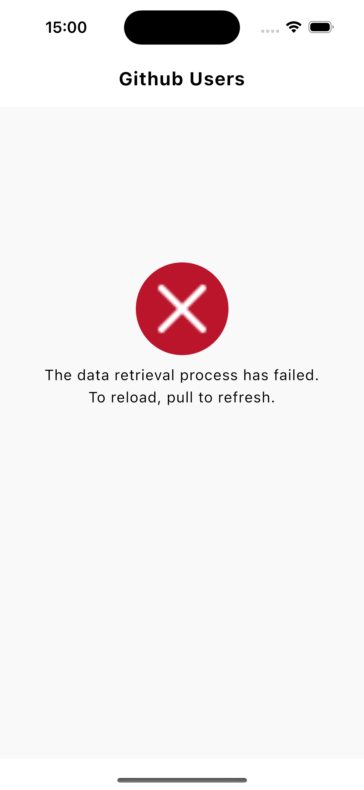

This is a Kotlin Multiplatform project targeting Android, iOS.

* `/composeApp` is for code that will be shared across your Compose Multiplatform applications.
  It contains several subfolders:
  - `commonMain` is for code that’s common for all targets.
  - Other folders are for Kotlin code that will be compiled for only the platform indicated in the folder name.
    For example, if you want to use Apple’s CoreCrypto for the iOS part of your Kotlin app,
    `iosMain` would be the right folder for such calls.

* `/iosApp` contains iOS applications. Even if you’re sharing your UI with Compose Multiplatform, 
  you need this entry point for your iOS app. This is also where you should add SwiftUI code for your project.
*
Learn more about [Kotlin Multiplatform](https://www.jetbrains.com/help/kotlin-multiplatform-dev/get-started.html)…

# Kotlin Multiplatform Compose Sample
Note: Replace with your own GitHub API key to increase rate limit in `RemoteRepoBase.kt` file.

## Screenshots
### Android

| List User                                             | List User Error                                             | User Detail                                             |
|-------------------------------------------------------|-------------------------------------------------------------|---------------------------------------------------------|
|  |  |  |

### iOS
| List User                                         | List User Error                                         | User Detail                                         |
|---------------------------------------------------|---------------------------------------------------------|-----------------------------------------------------|
|  |  |  |

## Demo Videos
| Android                                            | iOS                                            |
|----------------------------------------------------|------------------------------------------------|
|  |  |


## Technical Dependencies
- [Kotlin](https://kotlinlang.org/) based, [Coroutines](https://github.com/Kotlin/kotlinx.coroutines) + [Flow](https://kotlin.github.io/kotlinx.coroutines/kotlinx-coroutines-core/kotlinx.coroutines.flow/) for asynchronous.
- [Composable Multiplatform](https://jb.gg/compose) for building common UI. It simplifies and accelerates UI development on Android, iOS and Desktop.
- [Koin](https://insert-koin.io/) for dependency injection.
- [Ktor & Kotlin Serialization](https://ktor.io/) for constructing the REST APIs and paging network data.
- [SqlDelight](https://sqldelight.github.io/sqldelight/2.0.2/) for local database.
- [Voyager](https://github.com/adrielcafe/voyager) for navigation and screen models.
- [Coil](https://coil-kt.github.io/coil/getting_started/) An image loading library for Android and Compose Multiplatform

### Common Structure
```
├── composeApp
│   ├── androidMain
│   ├── commonMain
│   │   ├── kotlin/com/initium/assigment
│   │   │   ├── di                                           <––– Koin Depedenency Injection package
│   │   │   ├── domain
│   │   │   │   ├── base                                     <––– Base classes for domain layer
│   │   │   │   ├── model                                    <––– Domain models
│   │   │   │   ├── repository
│   │   │   │   │   ├── local                                <––– Local repository
│   │   │   │   │   ├── remote                               <––– Remote repository
│   │   │   │   └── services                                 <––– Services for domain layer => ui layer will use this
│   │   │   ├── ui
│   │   │   │   ├── app                                      <––– App Screens and ViewModels 
│   │   │   │   ├── core                                     <––– Navigation and screen models, state, event, etc
│   │   │   │   ├── theme                                    <––– Theme for the app
│   │   │   │   ├── uikit                                    <––– UIKit components for the app
│   │   ├── composeResources                                 <––– Resources to store local images and strings
│   │   └── sqldelight/com/initium/assigment                 <––– Local database entities
│   └── iosMain
└── ...
```
